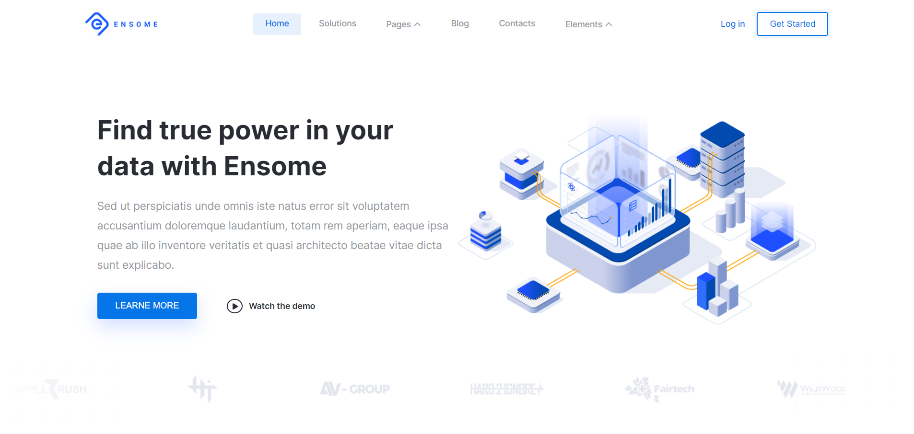

# [Ensome | React](https://ensome-web-site-react.vercel.app)

Welcome to the Ensome project repository! We are here to show you an incredible website for Date analyst !



## 🤖 About Ensome
📋 Website consisting of more than 10 pages and made taking into account all modern technologies.

## 🛠 Technologies Used

We've assembled quite the tech stack to bring Ensome to life:

- [React](https://react.dev/)
- [NextJs](https://nextjs.org/)
- [Scss](https://sasscss.org/)

**Libraries:** [`JSON Server`](https://www.npmjs.com/package/json-server), [`ReactQuery`](https://react-query-git-patch-1.tannerlinsley.vercel.app/overview),[`Framer Motion`](https://www.framer.com/motion/), [`Axios`](https://axios-http.com/),[`Atropos`](https://atroposjs.com/)


## 🚀 Getting Started

- Clone the repository
- Install dependencies with `npm install`
 ```bash
  npm install
  ```
- Run the development server with `npm run dev`
 ```bash
  npm run dev
  ```
- Open your browser and navigate to `http://localhost:3000`

## 📜 Disclaimer
Ensome is a fictional company created for demonstration purposes only. Any resemblance to real companies, living or dead, is purely coincidental.

## 🤝 Contributing
While Ensome isn't a real company, your contributions to this project are real and valued! Feel free to open issues or submit pull requests if you have ideas for improvements. Thank you!
